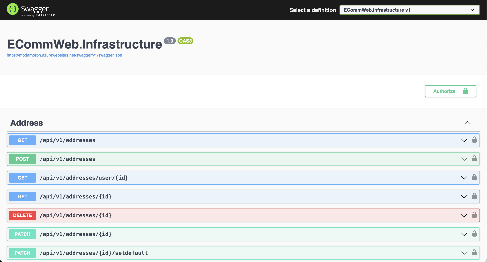
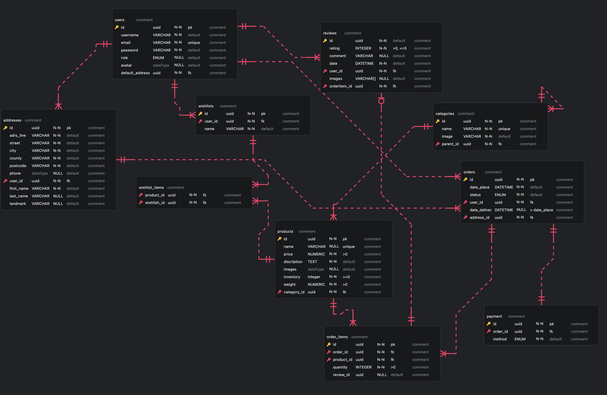
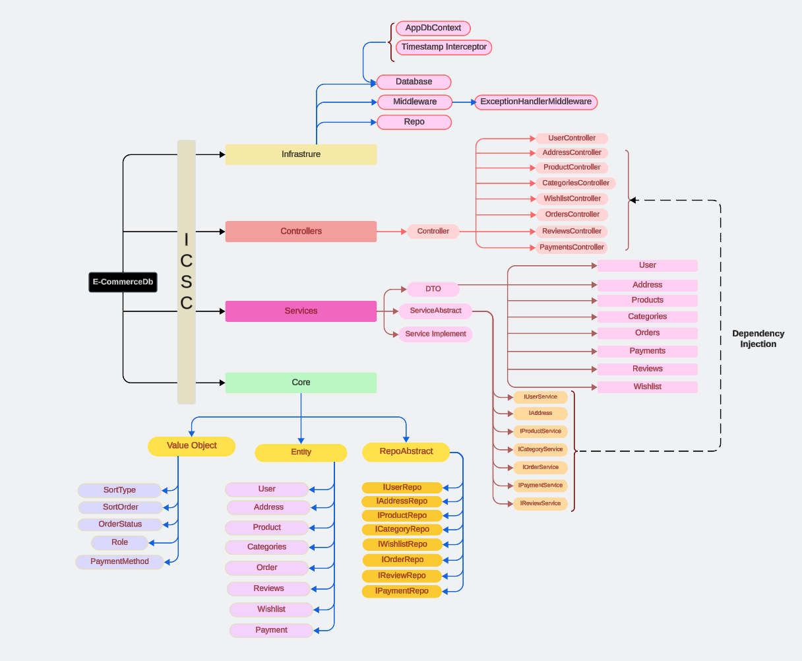

# E-Commerce BackEnd

This is a backend application built using `C# EF Core` and `ASP.Net Core 8`. It provides the REST API endpoints and uses `PostgreSQL` database for data persistence for any e-commerce website. This application is also equipped with `authentication` feature and uses token based authentication using `JWT`. This application follows `CLEAN` architecture pattern which is demonstrated in the corresponding sections to follow.

### Technologies used :

       

## Table of Contents

1. [Specification](#specification)
2. [Installation](#installation)
3. [ER Diagram](#relationship-diagram)
4. [Architecture Diagram](#backend-architecture)
5. [CLEAN Architecture](#clean-architecture)
6. [Folder Structure](#folder-structure)
7. [Endpoints](#endpoints)
8. [Contributing](#contributing)
9. [Contributors & Contribution](#contributors--contributions)
10. [Acknowledgement](#acknowledgements)

## Specification

This application presents all the REST API endpoints for CRUD operations related to E-Commerce Website. The link of the website are

- [shop-modamorph](https://shop-modamorph.netlify.app/)
- Please find the public [repository link](https://github.com/koyenadey/ECommWebUI) for the UI codebase.
- [shop-modamorph API](https://modamorph.azurewebsites.net/swagger/index.html)
- Please find the public [repository link](https://github.com/koyenadey/ECommWebApi) for the API codebase.
  

Currently it supports CRUD operations for the below entities -

- User
- Address
- Product
- Category
- Order

## Authentication

- login

## Installation

To run this project locally, follow these steps:

1. Clone the repository to your system:

```
git clone https://github.com/your_username/your_project.git
```

2. Navigate to the project directory & Install dependencies:

```
cd your_project
dotnet restore
```

3. To configure connection to your database plaese configure connections in `appsettings.json`

4. Run the Entity Framework Core Migrations:

- To Make sure there isnt any database of the same name, run :

```
dotnet ef database drop
```

- Prepare the migrations

```
dotnet ef migrations add <any message of your choice>
```

For example :

```C#
dotnet ef migrations add CreateDb
```

- Run the migrations

```
dotnet ef database update
```

- Run the application

```
dotnet watch run --project server/Server.Infrastructure/Server.Infrastructure.csproj
```

OR

```
dotnet run --project server/Server.Infrastructure/Server.Infrastructure.csproj
```

### Relationship Diagram



### BackEnd Architecture



### CLEAN Architecture

The backend is built upon the Clean Architecture which follows the inversion of control. The application is divided into 4 layers namely :

- **Core Layer** : Also known as Domain layer , houses all the Entities, Aggregate, ValueObjects & interfaces for the Repository.

- **Service Layer** : Commonly known as Business layer is responsible for all validations, Data Transformations & Mapping. It houses DTO,Service Interfaces & their implementation including the Authentication Service.

- **Controller** : This layer houses the endpoints that communicates with both front and database.

- **Infrastructure** : Also known as Web API layer serves the entry point of the application. Contains the program.cs files, Migrations, DbContext, Middleware,Services only the external ones, like Token Serviec, Sms service etc and Repository Implementation.

- **Tests** : It is not any layer technically and is not part of the architecture. But to know the application better you can run the tests and check the results.

## Folder Structure

```
server
│
├───Server.Core
│   ├───bin
│   ├───obj
│   ├───src
│   │   ├───src
│   │   ├───Common
│   │   ├───Entity
│   │   ├───RepoAbstract
│   │   ├───Validation
│   │   ├───ValueObject
│   ├───Server.Core.csproj
│
├───Server.Service
│   ├───bin
│   ├───obj
│   ├───src
│   │   ├───DTO
│   │   ├───ServiceAbstract
│   │   ├───ServiceImplement
│   ├───Server.Service.csproj
│
├───Server.Controller
│    ├───bin
│    ├───obj
│    ├───src
│    │   ├───Controller
│    ├───Server.Controller.csproj
│
├───Server.Infrastructure
│   ├───bin
│   ├───obj
│   ├───Migrations
│   ├───src
│   │   ├───Database
│   │   ├───Middleware
│   │   ├───Repo
│   ├───appsettings.development.json
│   ├───appsettings.json
│   ├───program.cs
│   ├───Server.Service.csproj
│   ├───Server.Infrastructure.http
│
├───Server.Test
├───.gitignore
├───server.sln
├───README.md
├───MindMap.png

```

## Endpoints:

### Entity :Authentication

| HTTP Method | Endpoint      | Description           |
| ----------- | ------------- | --------------------- |
| POST        | /auth/login   | Authentication        |
| GET         | /auth/profile | Get user with session |

### Entity: Users

| Http Method | Endpoint                          | Description            |
| ----------- | --------------------------------- | ---------------------- |
| GET         | /api/v1/users                     | Get all users          |
| GET         | /api/v1/users/:id                 | Get a single user      |
| POST        | /api/v1/users                     | Create a new user      |
| PATCH       | /api/v1/users/update/:id          | Update a user info     |
| PATCH       | /api/v1/users/change_password/:id | Update a user password |
| DELETE      | /api/v1/users/:id                 | Delete a user          |
| POST        | /api/v1/users/is_available        | Check email if exists  |

### Entity: Products

| Http Method | Endpoint                          | Description            |
| ----------- | --------------------------------- | ---------------------- |
| GET         | /api/v1/products                  | Get all products       |
| GET         | /api/v1/products/:id              | Get a single user      |
| POST        | /api/v1/users                     | Create a new user      |
| PATCH       | /api/v1/users/update/:id          | Update a user info     |
| PATCH       | /api/v1/users/change_password/:id | Update a user password |
| DELETE      | /api/v1/users/:id                 | Delete a user          |
| POST        | /api/v1/users/is_available        | Check email if exists  |

### Entity: Categories

| HTTP Method | Endpoint                 | Description                  |
| ----------- | ------------------------ | ---------------------------- |
| GET         | /categories              | Get all categories           |
| GET         | /categories/:id          | Get a single category        |
| GET         | /categories/:id/products | Get all products by category |
| POST        | /categories              | Create a category            |
| PATCH       | /categories/:id          | Update a category            |
| DELETE      | /categories/:id          | Delete a category            |

### Entity: Orders

| Functionality                | Method | Endpoint                                    |
| ---------------------------- | ------ | ------------------------------------------- |
| Get all orders               | GET    | /api/v1/orders?pageno=1&pageSize=10         |
| Get all order of a user user | GET    | /api/v1/orders/:userId?pageno=1&pagesize=10 |
| Get metadata                 | GET    | /api/v1/orders/metadata                     |
| Get a specific order         | GET    | /api/v1/orders:orderId                      |
| Create order                 | POST   | /api/v1/orders                              |
| Update an order              | PATCH  | /api/v1/orders/:orderId                     |
| Delete an order              | DELETE | /api/v1/orders/:orderId                     |

### Entity: Address

| Functionality               | HTTP Method | Endpoint                                       |
| --------------------------- | ----------- | ---------------------------------------------- |
| Get all addresses of a user | GET         | /api/v1/addresses                              |
| Get a single address        | GET         | /api/v1/addresses/:id                          |
| Create a new address        | POST        | /api/v1/addresses                              |
| Delete an address           | DELETE      | /api/v1/addresses/:id                          |
| Update an address           | PATCH       | /api/v1/addresses/:id                          |
| Set default address         | PATCH       | /api/v1/addresses/:id/set_default              |
| Get default address         | GET         | /api/v1/addresses/default                      |
| Get addresses sort by city  | GET         | /api/v1/addresses?sortByCity=<"asc" or "desc"> |
| Search addresses by city    | GET         | /api/v1/addresses?city=""                      |

### Entity: Cart

| Functionality                      | Method | Endpoint                 |
| ---------------------------------- | ------ | ------------------------ |
| Get the cart of a user             | GET    | /api/v1/cart             |
| Add a product to cart              | POST   | /api/v1/cart             |
| Delete a product from cart         | DELETE | /api/v1/cart/:product_id |
| Update the quantity of a cart item | PUT    | /api/v1/cart/:product_id |
| Clear cart                         | DELETE | /api/v1/cart/clear       |

### Entity: Payment

| Functionality                  | Method | Endpoint                  |
| ------------------------------ | ------ | ------------------------- |
| Get all payments of all orders | GET    | /api/v1/payments          |
| Get all payments of a user     | GET    | /api/v1/payments          |
| Create a payment of an order   | POST   | /api/v1/payments/:orderId |

## Contributing

We welcome contributions from the community to help improve our project. Whether you're reporting bugs, suggesting enhancements, or submitting pull requests, your input is valuable to us.

### Submitting Pull Requests

If you'd like to contribute code to the project, you can submit pull requests with your changes. Here's how you can do it:

1. Fork the repository and create a new branch for your feature or bug fix.
2. Make your changes and commit them to your branch. Please follow our [coding style guidelines](link_to_coding_style_guidelines) and ensure that your code is well-tested.
3. Push your branch to your forked repository on GitHub.
4. [Create a pull request](link_to_create_pull_request) against the `main` branch of our repository, explaining the purpose of your changes and referencing any related issues.

Our team will review your pull request and provide feedback. Once your changes are approved, we'll merge them into the project.

Thank you for contributing to our project and helping to make it better for everyone!

## Contributors & Contributions

This section acknowledges the individuals who have contributed to the development of the application and highlights their roles.

- **Yuanyuan Lu**
  - managed the gitgub repository & ERD diagram
  - reviwed PR's
  - created queries & endpoints for adresses, users, cart & wishlist.
- **Tin Nguyen**
  - reviwed PR's
  - created queries for database & endpoints for products & categories.
  - generated sampledata
- **Koyena Dey**
  - managed trello board, daily meeting
  - reviwed PR's
  - created queries & enpoints for orders, reviews & payments.

## Acknowledgements

We would like to express our gratitude to `Integrify Finland` and our tutor `Alia` & `Maryam` for enbling us to gather the knowledge and help to complete this application.
